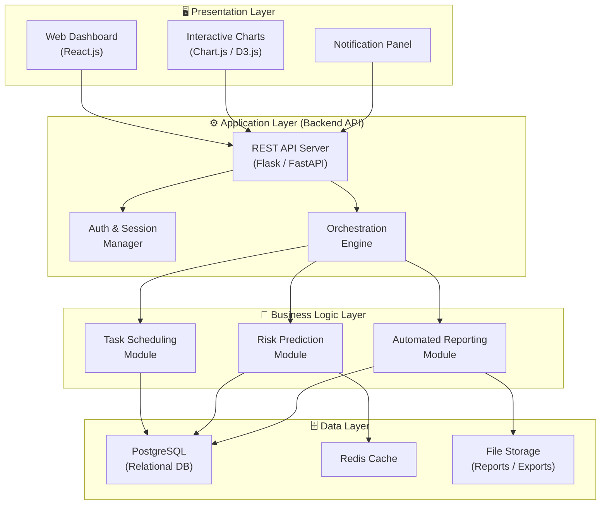
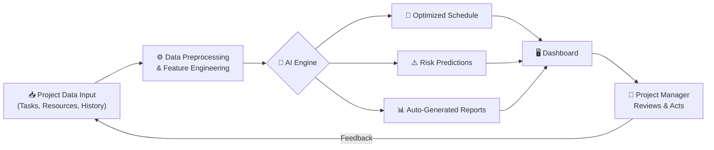
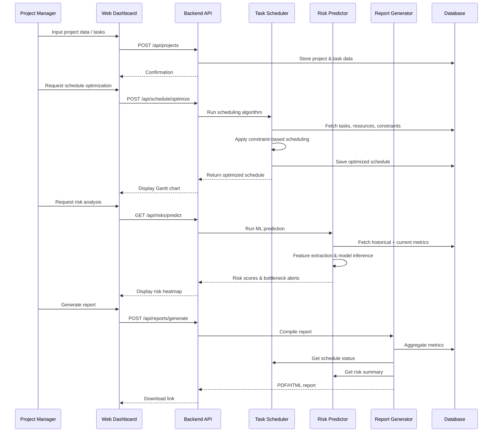
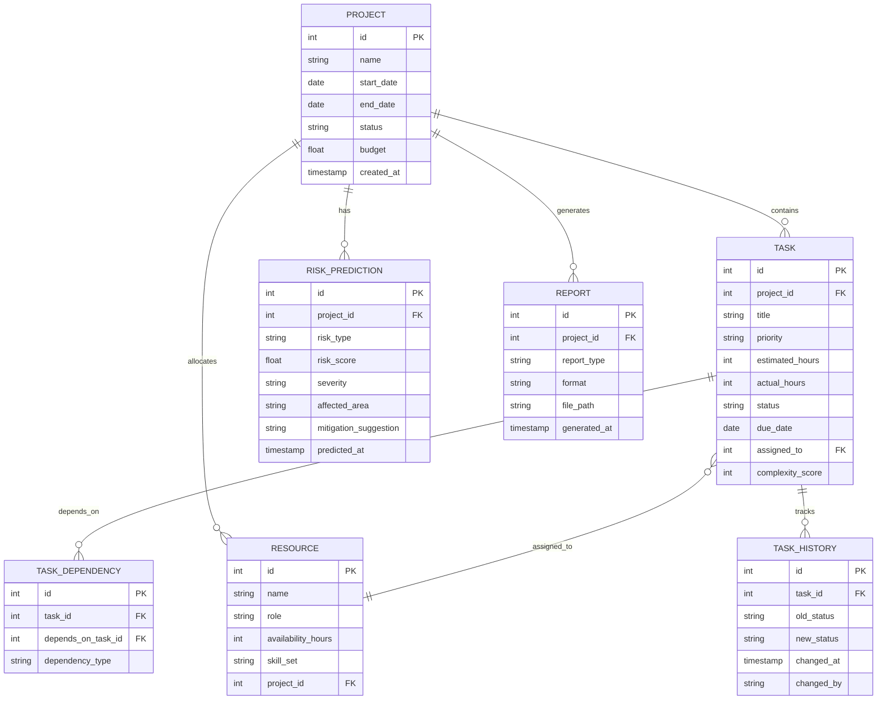
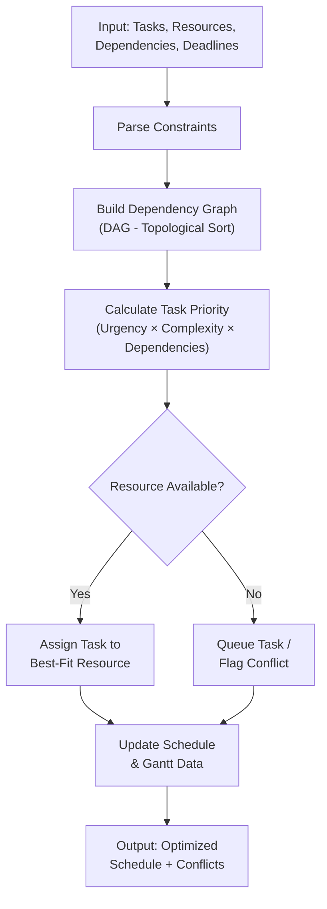
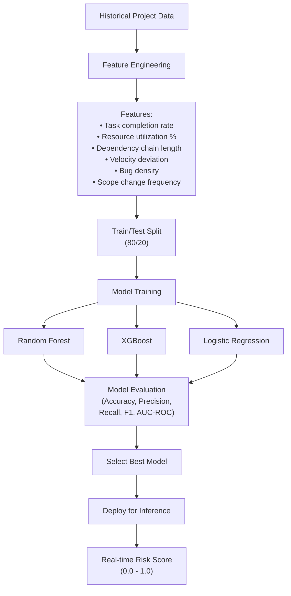
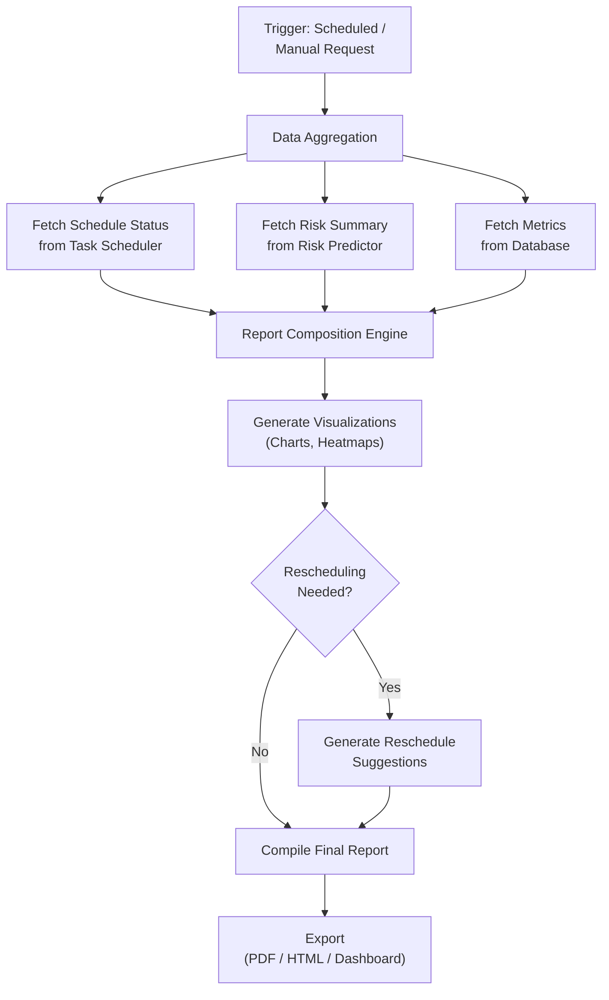
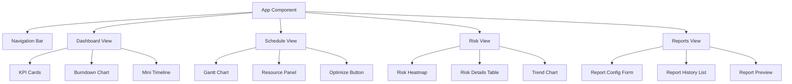
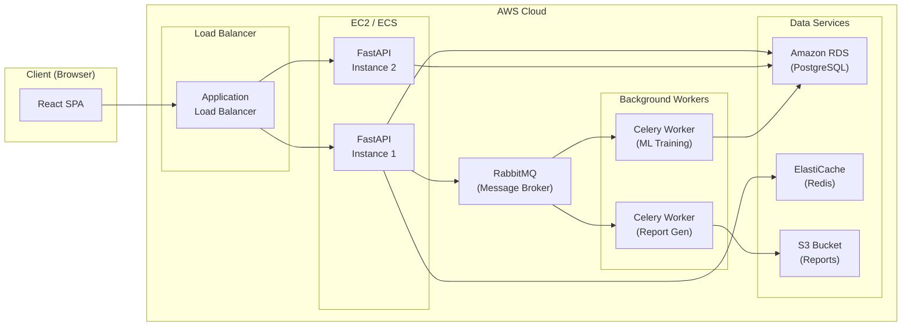

# AI-Based Decision Support System for Software Project Management
## High-Level Design (HLD) & Low-Level Design (LLD)

**Student:** Kollimarla Srikrupa (2024TM93132) | **Program:** M.Tech Software Engineering, BITS Pilani  
**Organization:** Amazon, Bengaluru | **Supervisor:** D Surya Sai

---

## 1. System Overview

The system is an **AI-powered Decision Support System (DSS)** that assists software project managers with three core capabilities:

| Module | Purpose | AI Technique |
|--------|---------|-------------|
| **Task Scheduling** | Optimizes resource allocation and task ordering | Rule-based algorithms + constraint satisfaction |
| **Risk Prediction** | Identifies potential bottlenecks early | ML classification (Random Forest, XGBoost) |
| **Automated Reporting** | Generates real-time reports and suggests re-scheduling | Data-driven analytics + NLP |

---

## 2. High-Level Design (HLD)

### 2.1 System Architecture — Layered View



### 2.2 High-Level Data Flow



### 2.3 Module Interaction Diagram



---

## 3. Low-Level Design (LLD)

### 3.1 Technology Stack

| Layer | Technology | Rationale |
|-------|-----------|-----------|
| **Frontend** | React.js + Ant Design | Component-based UI, rich charting support |
| **Backend API** | Python FastAPI | Async support, auto-docs, ML ecosystem |
| **ML/AI** | scikit-learn, XGBoost, pandas | Industry-standard ML libraries |
| **Database** | PostgreSQL | Relational integrity, JSON support |
| **Cache** | Redis | Fast lookups for risk scores |
| **Task Queue** | Celery + RabbitMQ | Async model training & report generation |
| **Deployment** | Docker + AWS EC2 | Containerized, scalable |

### 3.2 Database Schema (ER Diagram)



### 3.3 Module-Level Low-Level Design

---

#### 3.3.1 Task Scheduling Module

**Algorithm:** Constraint Satisfaction + Priority-Based Scheduling



**Key Classes:**

```
┌───────────────────────────────────┐
│      TaskScheduler                │
├───────────────────────────────────┤
│ - tasks: List[Task]               │
│ - resources: List[Resource]       │
│ - constraints: ConstraintGraph    │
├───────────────────────────────────┤
│ + optimize_schedule()             │
│ + resolve_conflicts()             │
│ + get_gantt_data()                │
│ + suggest_reschedule(task_id)     │
└───────────────────────────────────┘

┌───────────────────────────────────┐
│      ConstraintGraph              │
├───────────────────────────────────┤
│ - adjacency_list: Dict            │
│ - in_degree: Dict                 │
├───────────────────────────────────┤
│ + topological_sort()              │
│ + detect_cycles()                 │
│ + get_critical_path()             │
└───────────────────────────────────┘
```

---

#### 3.3.2 Risk Prediction Module

**ML Pipeline:**



**Risk Classification:**

| Risk Score | Severity | Action |
|-----------|----------|--------|
| 0.0 – 0.3 | 🟢 Low | Monitor |
| 0.3 – 0.6 | 🟡 Medium | Review & plan mitigation |
| 0.6 – 0.8 | 🟠 High | Immediate attention required |
| 0.8 – 1.0 | 🔴 Critical | Escalate & reschedule |

**Key Classes:**

```
┌───────────────────────────────────┐
│      RiskPredictor                │
├───────────────────────────────────┤
│ - model: TrainedModel             │
│ - feature_extractor: FeatureEng   │
│ - threshold: float                │
├───────────────────────────────────┤
│ + train(historical_data)          │
│ + predict_risk(project_id)        │
│ + get_feature_importance()        │
│ + explain_prediction(task_id)     │
└───────────────────────────────────┘

┌───────────────────────────────────┐
│      FeatureEngineering           │
├───────────────────────────────────┤
│ - raw_data: DataFrame             │
├───────────────────────────────────┤
│ + extract_velocity_features()     │
│ + extract_complexity_features()   │
│ + extract_dependency_features()   │
│ + normalize()                     │
└───────────────────────────────────┘
```

---

#### 3.3.3 Automated Reporting Module



**Report Types:**

| Report | Content | Frequency |
|--------|---------|-----------|
| Sprint Status | Task progress, burndown chart, blockers | Weekly |
| Risk Assessment | Risk heatmap, top-5 risks, trends | On-demand |
| Resource Utilization | Allocation %, idle time, skill gaps | Bi-weekly |
| Executive Summary | KPIs, milestones, budget burn | Monthly |

---

### 3.4 API Design

| Method | Endpoint | Description |
|--------|----------|-------------|
| `POST` | `/api/projects` | Create a new project |
| `GET` | `/api/projects/{id}` | Get project details |
| `POST` | `/api/projects/{id}/tasks` | Add tasks to project |
| `PUT` | `/api/tasks/{id}` | Update task details |
| `POST` | `/api/schedule/optimize` | Run schedule optimization |
| `GET` | `/api/schedule/{project_id}` | Get current schedule |
| `GET` | `/api/risks/predict/{project_id}` | Run risk prediction |
| `GET` | `/api/risks/{project_id}/history` | Get historical risk data |
| `POST` | `/api/reports/generate` | Generate a report |
| `GET` | `/api/reports/{id}/download` | Download report file |
| `POST` | `/api/resources` | Add a resource |
| `GET` | `/api/dashboard/{project_id}` | Get dashboard metrics |

---

### 3.5 Frontend Component Hierarchy



---

### 3.6 Deployment Architecture



---

## 4. Directory Structure (Recommended)

```
ai-dss-project-management/
├── backend/
│   ├── app/
│   │   ├── main.py                 # FastAPI entry point
│   │   ├── config.py               # App configuration
│   │   ├── models/                 # SQLAlchemy ORM models
│   │   │   ├── project.py
│   │   │   ├── task.py
│   │   │   ├── resource.py
│   │   │   └── risk.py
│   │   ├── routers/                # API route handlers
│   │   │   ├── projects.py
│   │   │   ├── tasks.py
│   │   │   ├── schedule.py
│   │   │   ├── risks.py
│   │   │   └── reports.py
│   │   ├── services/               # Business logic
│   │   │   ├── scheduler.py        # Task Scheduling Module
│   │   │   ├── risk_predictor.py   # Risk Prediction Module
│   │   │   └── report_generator.py # Reporting Module
│   │   ├── ml/                     # ML pipeline
│   │   │   ├── feature_engineering.py
│   │   │   ├── model_training.py
│   │   │   ├── model_evaluation.py
│   │   │   └── models/             # Saved .pkl models
│   │   └── utils/
│   │       ├── graph.py            # DAG utilities
│   │       └── pdf_generator.py
│   ├── tests/
│   ├── requirements.txt
│   └── Dockerfile
├── frontend/
│   ├── src/
│   │   ├── components/
│   │   │   ├── Dashboard/
│   │   │   ├── Schedule/
│   │   │   ├── RiskView/
│   │   │   └── Reports/
│   │   ├── services/               # API client calls
│   │   ├── App.jsx
│   │   └── index.jsx
│   ├── package.json
│   └── Dockerfile
├── docker-compose.yml
└── README.md
```

---

## 5. Evaluation Metrics

| Metric | What It Measures | Target |
|--------|-----------------|--------|
| **Schedule Deviation** | % difference between AI-generated vs actual completion | < 15% |
| **Risk Prediction Accuracy** | F1-score of ML model on test data | ≥ 0.80 |
| **Time Savings** | Reduction in manual planning effort | ≥ 40% |
| **User Satisfaction** | Survey score from project managers | ≥ 4/5 |
| **Report Generation Time** | Time to produce a full status report | < 30 seconds |

---

## 6. Build Approach — Phase-Wise Implementation

```mermaid
gantt
    title Implementation Timeline
    dateFormat  YYYY-MM-DD
    section Phase 1 - Foundation
        Database Schema & Models          :a1, 2026-01-22, 5d
        Backend API Skeleton              :a2, after a1, 3d
        Frontend Scaffold                 :a3, after a1, 3d
    section Phase 2 - Core Modules
        Task Scheduling Module            :b1, after a2, 7d
        Risk Prediction ML Pipeline       :b2, after a2, 10d
        Gantt Chart UI                    :b3, after a3, 5d
    section Phase 3 - Reporting
        Report Generator                  :c1, after b1, 5d
        Dashboard & Visualizations        :c2, after b3, 5d
    section Phase 4 - Integration & Testing
        End-to-End Integration            :d1, after c1, 5d
        Testing & Performance Tuning      :d2, after d1, 7d
        User Evaluation                   :d3, after d2, 3d
```

> [!TIP]
> **Start with Phase 1** — get the database and API skeleton working first. This gives you a solid foundation to build all three modules incrementally.

> [!IMPORTANT]
> **Data Collection is key** — For the Risk Prediction module, ensure you have access to historical project data (at least 100+ project records with outcome labels) for meaningful model training. Synthetic data generation is acceptable for the prototype.
